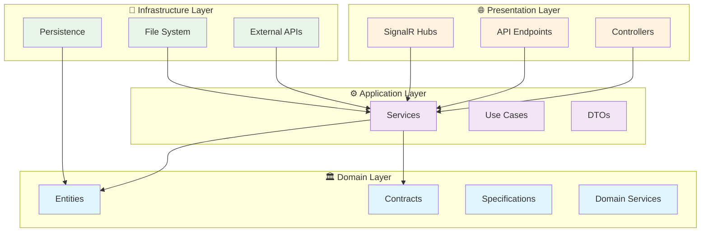
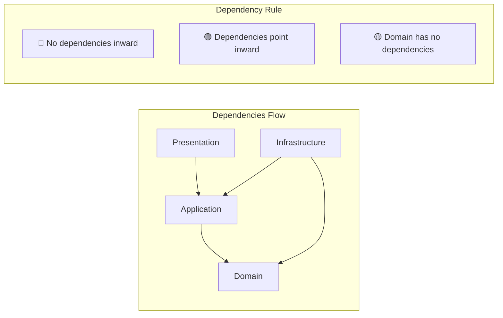
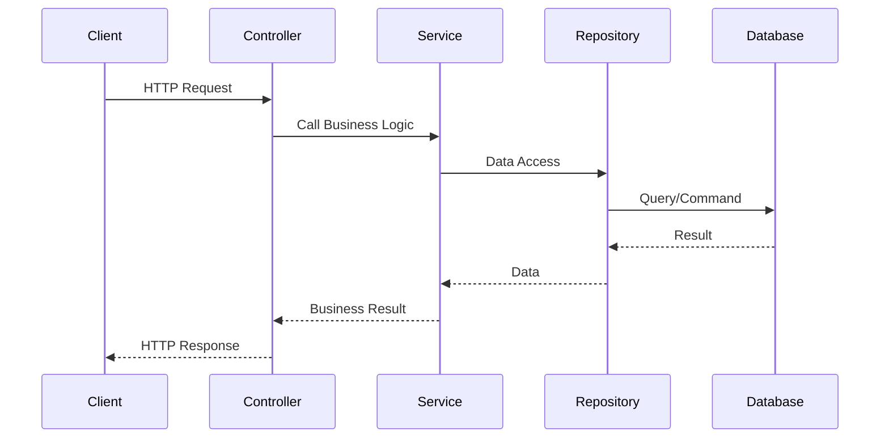

# 🏗️ OnionArchDemo - .NET Onion Architecture Demo

[](https://dotnet.microsoft.com/)
[](https://en.wikipedia.org/wiki/Onion_architecture)
[](LICENSE)

A comprehensive .NET demo project showcasing **Onion Architecture** with clean separation of concerns, dependency inversion, and enterprise-level patterns. This project serves as a reference implementation for building scalable, maintainable .NET applications.

## 📋 Table of Contents

- [🏗️ Overview](#-overview)
- [🎯 Architecture](#-architecture)
- [📁 Project Structure](#-project-structure)
- [🚀 Features](#-features)
- [⚙️ Prerequisites](#️-prerequisites)
- [🛠️ Installation & Setup](#️-installation--setup)
- [🏃‍♂️ Running the Application](#️-running-the-application)
- [📊 Database Configuration](#-database-configuration)
- [🔧 Configuration](#-configuration)
- [🧪 Testing](#-testing)
- [📚 API Documentation](#-api-documentation)
- [🤝 Contributing](#-contributing)
- [📄 License](#-license)

## 🏗️ Overview

**OnionArchDemo** is a demonstration project that implements the **Onion Architecture** (also known as Clean Architecture) in .NET 8. This architecture promotes:

- 🔄 **Dependency Inversion**: High-level modules don't depend on low-level modules
- 🧩 **Separation of Concerns**: Clear boundaries between different layers
- 🧪 **Testability**: Easy to unit test business logic
- 🔧 **Maintainability**: Changes in one layer don't affect others
- 📈 **Scalability**: Easy to extend and modify

## 🎯 Architecture

### Onion Architecture Diagram



### Layer Dependencies



## 📁 Project Structure

```
OnionArchDemo/
├── 🏛️ Domain/                          # Core Business Logic
│   ├── Contracts/                      # Interfaces & Contracts
│   │   ├── IGenaricRepository.cs      # Generic Repository Interface
│   │   ├── IUnitOfWork.cs             # Unit of Work Interface
│   │   └── SpecificationContracts/    # Specification Pattern
│   ├── Entities/                      # Domain Entities
│   │   ├── BaseEntity.cs              # Base Entity Class
│   │   ├── CoreEntities/              # Business Entities
│   │   └── IdentityEntity/            # Identity Entities
│   └── Exceptions/                    # Domain Exceptions
│
├── ⚙️ Service/                         # Application Services
│   ├── CoreServices/                  # Business Logic Implementation
│   ├── Auto_Mapper_Profile/           # AutoMapper Configurations
│   ├── Exception_Implementation/      # Exception Handling
│   └── Specefication_Implementation/  # Specification Implementation
│
├── 🔧 ServiceAbstraction/             # Service Interfaces
│   └── Class1.cs                      # Service Contracts
│
├── 🗄️ Presistence/                    # Data Access Layer
│   ├── Data/                          # Database Context
│   │   ├── ApplicationDbContext.cs    # EF Core Context
│   │   ├── Configuration/             # Entity Configurations
│   │   └── DataSeed/                  # Database Seeding
│   ├── Repositories/                  # Repository Implementations
│   │   └── GenericRepository.cs       # Generic Repository
│   ├── UnitOfWork/                    # Unit of Work Pattern
│   │   └── UnitOfWork.cs              # Unit of Work Implementation
│   └── SpeceficationEvaluation.cs     # Specification Evaluator
│
├── 🌐 Presentation/                    # API Layer
│   ├── Controllers/                   # API Controllers
│   └── Hubs/                          # SignalR Hubs
│
├── 📦 SharedData/                      # Shared DTOs & Models
│   ├── DTOs/                          # Data Transfer Objects
│   └── Enums/                         # Shared Enumerations
│
└── 🚀 OnionArchDemo/                   # Web API Project
    ├── Controllers/                   # API Controllers
    ├── Program.cs                     # Application Entry Point
    └── appsettings.json              # Configuration
```

## 🚀 Features

### ✅ Implemented Patterns

- **🏗️ Onion Architecture**: Clean separation of concerns
- **📦 Repository Pattern**: Generic repository with specifications
- **🔄 Unit of Work**: Transaction management
- **🔍 Specification Pattern**: Flexible querying
- **🎯 Dependency Injection**: IoC container configuration
- **🗄️ Entity Framework Core**: ORM with SQL Server
- **📋 AutoMapper**: Object-to-object mapping
- **🔒 Exception Handling**: Centralized error management

### 🛠️ Technical Stack

- **.NET 8**: Latest .NET framework
- **ASP.NET Core Web API**: RESTful API framework
- **Entity Framework Core**: Object-relational mapping
- **SQL Server**: Database engine
- **AutoMapper**: Object mapping
- **Swagger/OpenAPI**: API documentation
- **SignalR**: Real-time communication (planned)

## ⚙️ Prerequisites

Before running this project, ensure you have the following installed:

- [.NET 8 SDK](https://dotnet.microsoft.com/download/dotnet/8.0)
- [SQL Server](https://www.microsoft.com/en-us/sql-server/sql-server-downloads) (Express or Developer Edition)
- [Visual Studio 2022](https://visualstudio.microsoft.com/) or [VS Code](https://code.visualstudio.com/)
- [Git](https://git-scm.com/)

## 🛠️ Installation & Setup

### 1. Clone the Repository

```bash
git clone https://github.com/yourusername/onionarchdemo.git
cd onionarchdemo
```

### 2. Restore Dependencies

```bash
dotnet restore
```

### 3. Configure Database Connection

Update the connection string in `OnionArchDemo/appsettings.json`:

```json
{
  "ConnectionStrings": {
    "DefaultConnection": "Server=(localdb)\\mssqllocaldb;Database=OnionArchDemoDb;Trusted_Connection=true;MultipleActiveResultSets=true"
  }
}
```

### 4. Run Database Migrations

```bash
cd Presistence
dotnet ef database update
```

## 🏃‍♂️ Running the Application

### Development Mode

```bash
cd OnionArchDemo
dotnet run
```

The application will be available at:
- **API**: https://localhost:7001
- **Swagger UI**: https://localhost:7001/swagger

### Production Mode

```bash
dotnet publish -c Release
dotnet OnionArchDemo.dll
```

## 📊 Database Configuration

### Entity Framework Setup

The project uses Entity Framework Core with the following configuration:

```csharp
// PresistenceLayerConfiguration.cs
services.AddDbContext<ApplicationDbContext>(options =>
    options.UseSqlServer(
        configuration.GetConnectionString("DefaultConnection"),
        sqlOptions => sqlOptions.EnableRetryOnFailure()
    ));
```

### Repository Pattern Implementation

```csharp
// Generic Repository with Specification Pattern
public class GenericRepository<T, TK> : IGenaricRepository<T, TK> 
    where T : BaseEntity<TK>
{
    // CRUD operations with specification support
}
```

## 🔧 Configuration

### App Settings Structure

```json
{
  "ConnectionStrings": {
    "DefaultConnection": "your-connection-string"
  },
  "Logging": {
    "LogLevel": {
      "Default": "Information",
      "Microsoft.AspNetCore": "Warning"
    }
  },
  "AllowedHosts": "*"
}
```

### Dependency Injection Setup

```csharp
// Program.cs
builder.Services.AddPresistenceConfig(builder.Configuration);
builder.Services.AddControllers();
builder.Services.AddEndpointsApiExplorer();
builder.Services.AddSwaggerGen();
```

## 🧪 Testing

### Running Tests

```bash
# Run all tests
dotnet test

# Run tests with coverage
dotnet test --collect:"XPlat Code Coverage"
```

### Test Structure

```
Tests/
├── Domain.Tests/           # Domain layer tests
├── Service.Tests/          # Service layer tests
├── Presistence.Tests/      # Data access tests
└── Integration.Tests/      # Integration tests
```

## 📚 API Documentation

### Swagger UI

Access the interactive API documentation at:
```
https://localhost:7001/swagger
```

### API Endpoints

| Method | Endpoint | Description |
|--------|----------|-------------|
| GET | `/api/weatherforecast` | Get weather forecast |
| POST | `/api/entities` | Create new entity |
| GET | `/api/entities/{id}` | Get entity by ID |
| PUT | `/api/entities/{id}` | Update entity |
| DELETE | `/api/entities/{id}` | Delete entity |

## 🏗️ Architecture Benefits

### 1. **Dependency Inversion**
- High-level modules don't depend on low-level modules
- Both depend on abstractions

### 2. **Separation of Concerns**
- Clear boundaries between layers
- Each layer has a specific responsibility

### 3. **Testability**
- Business logic can be tested independently
- Easy to mock dependencies

### 4. **Maintainability**
- Changes in one layer don't affect others
- Easy to understand and modify

### 5. **Scalability**
- Easy to add new features
- Simple to extend existing functionality

## 🔄 Data Flow



## 🤝 Contributing

We welcome contributions! Please follow these steps:

1. **Fork** the repository
2. **Create** a feature branch (`git checkout -b feature/amazing-feature`)
3. **Commit** your changes (`git commit -m 'Add amazing feature'`)
4. **Push** to the branch (`git push origin feature/amazing-feature`)
5. **Open** a Pull Request

### Development Guidelines

- Follow the existing code style
- Add unit tests for new features
- Update documentation as needed
- Ensure all tests pass before submitting

## 📄 License

This project is licensed under the MIT License - see the [LICENSE](LICENSE) file for details.

## 🙏 Acknowledgments

- **Onion Architecture** by Jeffrey Palermo
- **Clean Architecture** by Robert C. Martin
- **.NET Community** for excellent tooling and documentation

---

<div align="center">

**Made with ❤️ for the .NET Community**

[](https://github.com/yourusername/onionarchdemo)
[](https://github.com/yourusername/onionarchdemo)
[](https://github.com/yourusername/onionarchdemo/issues)

</div>